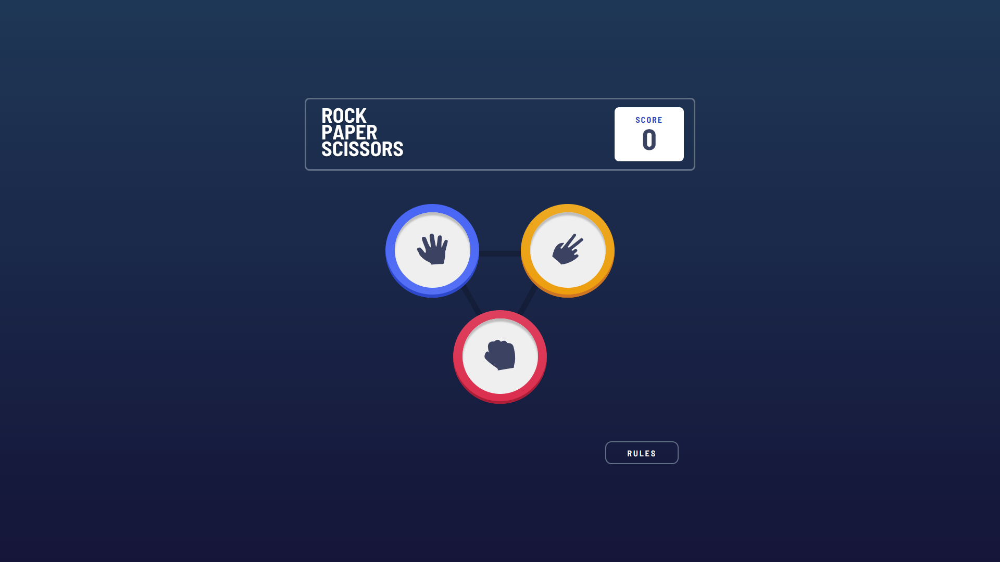

# Frontend Mentor - Rock, Paper, Scissors solution

This is a solution to the [Rock, Paper, Scissors challenge on Frontend Mentor](https://www.frontendmentor.io/challenges/rock-paper-scissors-game-pTgwgvgH). 
## Table of contents

- [Overview](#overview)
  - [The challenge](#the-challenge)
  - [Screenshot](#screenshot)
  - [Links](#links)
- [My process](#my-process)
  - [Built with](#built-with)
  - [What I learned](#what-i-learned)
  - [Continued development](#continued-development)
  - [Useful resources](#useful-resources)

## Overview

### The challenge

Your task is to build out the project to the designs inside the `/design` folder. You can either choose the `original` designs for the simpler version or the `bonus` designs for the harder version. You will find both mobile and desktop versions of the design to work to. Each file is also named depending on which step in the game the design is for.

The designs are in JPG static format. Using JPGs will mean that you'll need to use your best judgment for styles such as `font-size`, `padding` and `margin`. 

Users should be able to:

- View the optimal layout for the game depending on their device's screen size
- Play Rock, Paper, Scissors against the computer
- Maintain the state of the score after refreshing the browser _(optional)_
- **Bonus**: Play Rock, Paper, Scissors, Lizard, Spock against the computer _(optional)_

### Rules

If the player wins, they gain 1 point. If the computer wins, the player loses one point.

#### Original

- Paper beats Rock
- Rock beats Scissors
- Scissors beats Paper

#### Bonus

- Scissors beats Paper
- Paper beats Rock
- Rock beats Lizard
- Lizard beats Spock
- Spock beats Scissors
- Scissors beats Lizard
- Paper beats Spock
- Rock beats Scissors
- Lizard beats Paper
- Spock beats Rock

Not sure what Rock, Paper, Scissors, Lizard, Spock is? [Check out this clip from The Big Bang Theory](https://www.youtube.com/watch?v=iSHPVCBsnLw).

### Screenshot

I've attached 4 screenshots in the `/screenshots` folder: mobile, tablet, desktop, and fullscreen.

### Links

I'll update these links once I've submitted my solution.

- [Solution URL](https://your-solution-url.com)
- [Live Site URL](https://your-live-site-url.com)

## My process

### Built with

- Semantic HTML5 markup
- CSS custom properties
- Flexbox
- CSS Grid
- Mobile-first workflow
- Vanilla JS

### What I learned

I learned that there's no shortcut in implementing a lightbox. Inasmuch as I'd like to believe there's a
simple switch you can flip to darken everything in the background the way you want, that doesn't exist.

I'll just have to keep my head down and work on the individual colors of different components on the screen 
because depending on the color, each is going to have a unique appearance to show it's been dimmed. 

I also used local storage in this challenge. It's something I haven't tinkered with much, but it was nice to have a refresher on it. 

### Continued development

This is my last FrontEnd Mentor challenge for a little while as I shift gears into other projects. It's been one hell of a ride these past few weeks, and I've grown tremendously in more ways than I could ever imagine.

My goal going forward is to learn some Sass and implement it in some of the challenges I've completed. This will also give me an opportunity to practice using branches in Git since I'll be considering these "upgrades" as "features".

I've also made progress with JavaScript. This particular challenge helped me work on certain concepts like
local storage, loops, DOM manipulation, and writing clean code that's easy to read and understand. 

I do intend on practicing some more with JS. I like where I'm at, but I'd like to have some more experience and keep getting better. 

Finally, I set aside 3 days in advance to finish this challenge because it's labelled as advanced, so I 
opted to add some extra time, mostly because I wasn't sure what to expect. 

I wasn't feeling too well the first day, so I really began on the second day and completed it in 2 days, so 
technically, I only spent 2 days. I'm glad things turned out better than I expected.

There was a bit of a hiccup towards the end where I noticed I hard-coded the words "Rock, Paper, Scissors"
instead of using the logo image provided, so I lost a bit time correcting that mistake as well styling for
different screen sizes.

All in all, I'm satisfied with the outcome. 

Looking forward to working more with React and Sass going forward. 

Here's to greater things!

### Useful resources

- [setTimeout()](https://developer.mozilla.org/en-US/docs/Web/API/setTimeout) - I was kind of confused why the `setTimeout()` wasn't working, but this article cleared things up for me. Simply put, instead of calling the method in the first argument - my initial mistake - pass an arrow/regular function there.